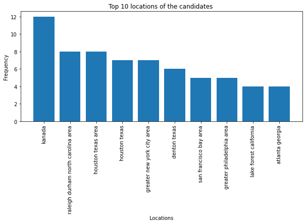
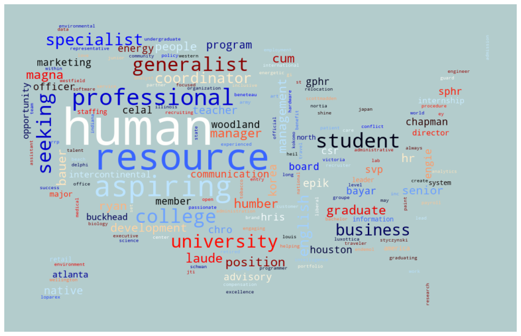
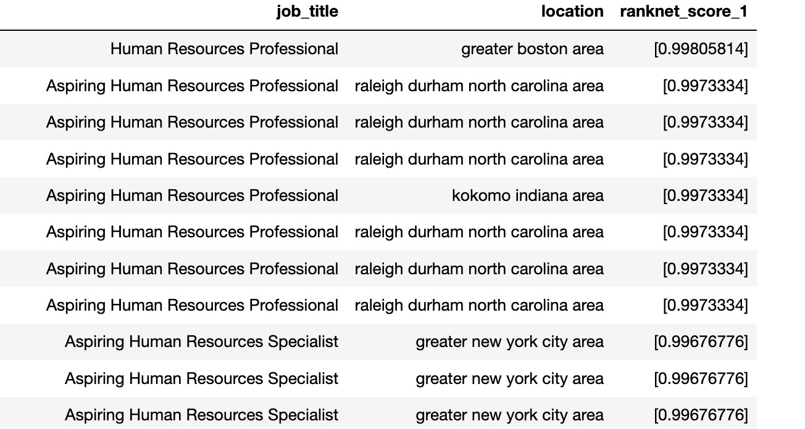
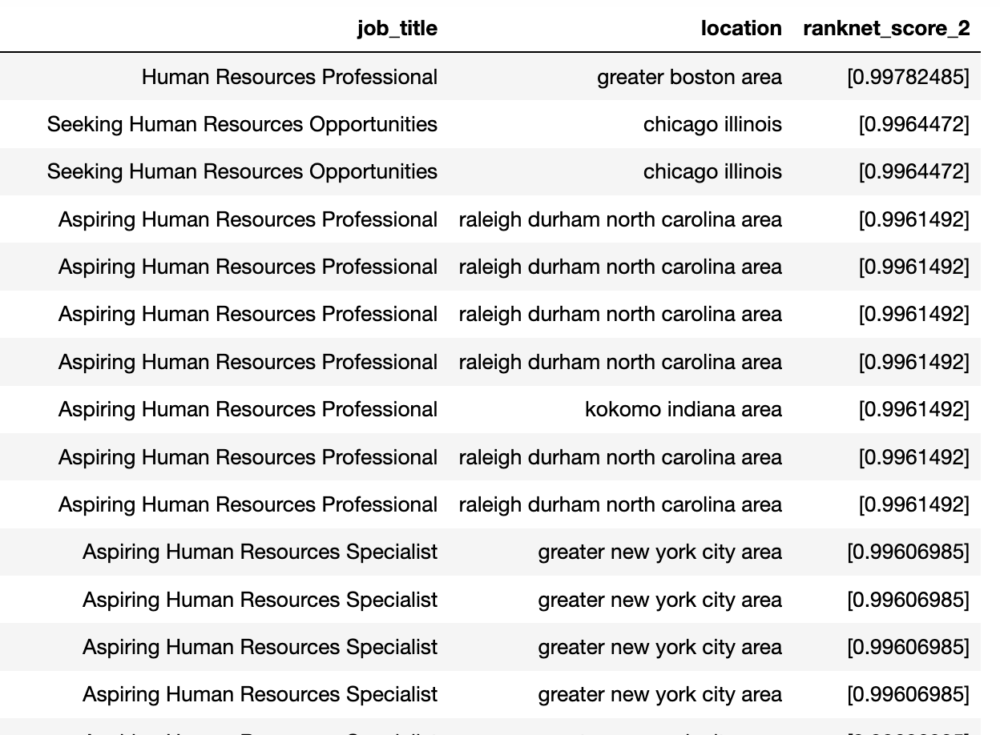

## l5hqsLz99zxcdhH7

# PotentialTalents

## Project Overview:
The problem statement for this project is to help the company eliminate the manual efforts invested in screening the candidates who are the right fit for the position they need to be hired for. The project is carried out in two phases. 
 
#### Phase 1 : Rank the Candidates
The goal of phase one is to rank the candidates based on the search queries provided automatically.
A machine learning model is created to find the similarity between the candidate title and the search query provided to achieve the goal. And based on the similarity score, we will be ranking the candidates. 

In technical terms goal is to build a model for predicting how to fit the candidate for a particular role. Keywords to be used for search are 'Aspiring human resources' or 'Seeking human resources'. The model's output indicates how fit the candidate is for the role? (numeric, probability between 0-1) 
 

#### Phase 2 : Re-Rank the Candidates based on user inputs
The goal of phase two is to let Human resources individual/end-user using this model provide priority to any individual who they think might be good for the role but was ranked lower by the model. Then based on the inputs provided, the model will re-rank the candidates keeping the human inputs into consideration. 

The data set consists of multiple text and a numeric features. The goal of the project will be to learn from all the features provided and predict  how fit the candidate is for the role? (numeric, probability between 0-1)

# Exploratory Data analysis Findings:
From Exploratory data findings we have figured out the top 10 locations and the most used used words used in job tittles and locations. 
 
 
 

 
    

    

    

        
<h4>   Top 20 Locations of candidates in dataset </h4> 

    

 
    

    

    

        
<h4>   Top words used in job tittle of candidates in dataset </h4> 

    

 
 
From the word cloud we can deduce that most of the job title have human, resource, professional as the most common words.

# Machine Learning model used:

We have used multiple NLP techniques like  
<ol>
     a. tf-idf cosine similarity 
     b. Word2vec cosine similarity using pre-trained model 
     c. Word2vec cosine similarity via Transfer learning 
     d. GloVe pre-trained model embeddings for similarity calculation 
     e. fastText pre-trained model embeddings for similarity calculation 
     f. Bert pre-trained model embeddings for similarity calculation 
</ol>
for building the ranking model. The fastText pre-trained model embedding seems to be working good for building the ranking model. 
And we have used fastText pre-trained embeddengings as input for building our re-ranker model using Custom RankNet implementation.

# Conclusion:

After using multiple NLP techniques like tf-idf , Word2vec using pre-trained model embeddings, Word2vec via Transfer learning, GloVe pre-trained model embeddings, fastText pre-trained model embeddings, Bert pre-trained model embeddings for cosine similarity calculations.
For checking simillarity between the given query tittles - 'Aspiring human resources' and 'seeking human resources' and the candidates title the fastText embeddings seems to be the best choice for ranking the candidates against the queries provided. Also, the mechanism implemented for Re-Ranking is also able perform really good based on the inputs provided. Which is evident from the change in similarity scores for ranked candidates and re-ranked candidates.

##### Top 10 Results for Query 1 - 'Aspiring human resources' 
 
 

 
    

    

    

        
<h4>   Top job tittle of candidates matched against the query  </h4> 

    

 
 
 
##### Top 10 Results for Query 2 - 'Seeking human resources'
 
 

 
    

    

    

        
<h4>   Top job tittle of candidates matched against the query  </h4> 

    

